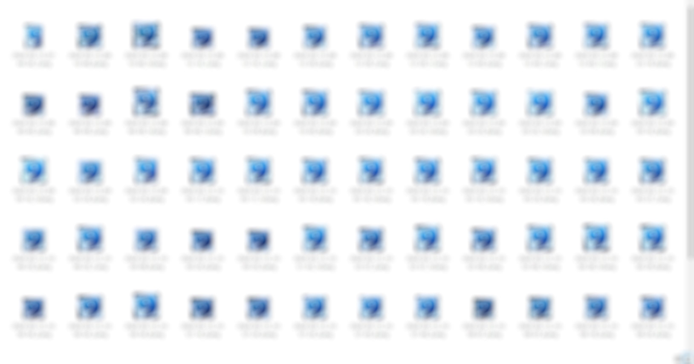

A script to generate label crops from images, grouped by the class, so that it's easy to verify if the labels were assigned correctly. Just open a generated directory for a class and see if there are any wrong labels.

Before using adjust these parameters in code:

```
image_dir = 'images'
label_dir = 'labels'
image_format = 'png'
```

Paths are relative to the current directory. The classes directories will be generated in the current directory.

